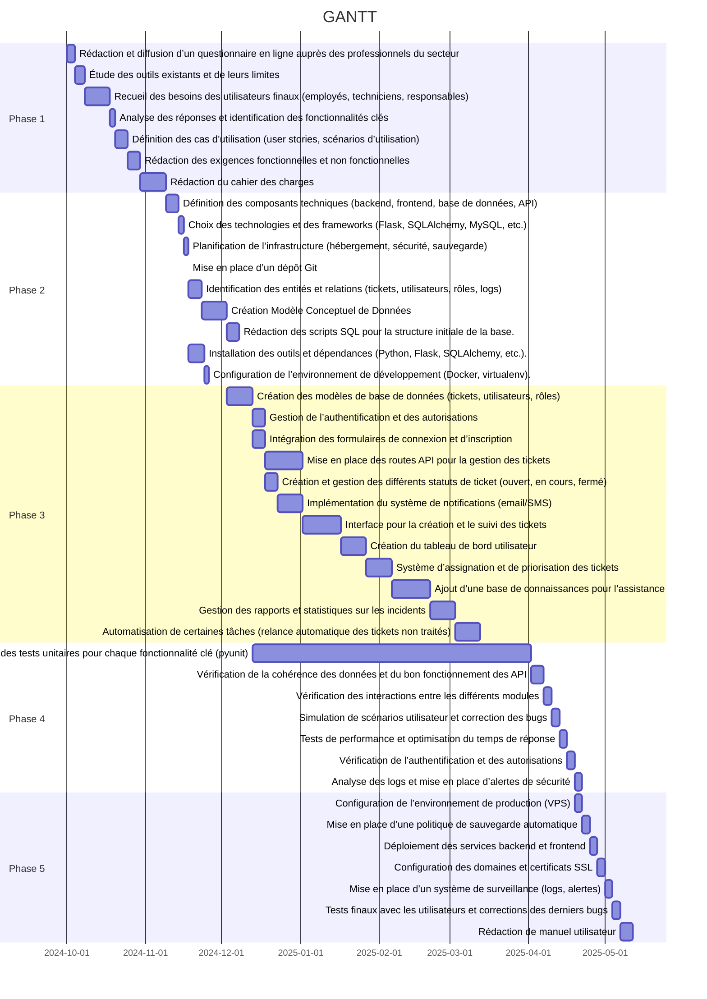

# 1 **Présentation du Projet AppTicket**

## **1.1 Introduction**

L'objectif du projet **AppTicket**, réalisé dans le cadre de notre **BTS SIO**, est de concevoir et développer une application web de gestion de tickets d'incidents. Cette application vise à améliorer la gestion des demandes d'assistance et à optimiser le suivi des problèmes rencontrés par les utilisateurs.

Le projet repose sur une architecture **Flask** pour la partie backend,  **SQLAlchemy** et **MySql** pour la gestion des données, et une interface web facilitant l'interaction avec les utilisateurs.

## **1.2 Recueil des Besoins**

Avant de lancer l'implémentation, nous avons réalisé un **recueil des besoins** afin d'affiner les exigences du projet. Cette phase a permis de mieux comprendre les attentes des futurs utilisateurs et d'adapter l'architecture de l'application en conséquence.

### **1.2.1 Méthodologie employée**

Nous avons procédé en plusieurs étapes :

-   **Questionnaire en ligne envoyé à des professionnels du secteur** pour identifier les besoins et attentes.
-   **Analyse des processus existants** afin d’identifier les améliorations possibles.
-   **Benchmarking** des solutions existantes pour identifier les bonnes pratiques.
-   **Définition des cas d'utilisation** et formalisation des exigences fonctionnelles et non fonctionnelles.

### **1.2.2 Principaux besoins identifiés**

Suite à cette analyse, nous avons défini les fonctionnalités clés du projet :

1.  **Création et gestion des tickets** avec des statuts clairs (ouvert, en cours, résolu, fermé).
2.  **Authentification et gestion des utilisateurs** avec des rôles distincts (utilisateur, support, administrateur).
3.  **Système de notifications** (email/SMS) pour informer les utilisateurs des mises à jour sur leurs tickets.
4.  **Gestion des priorités et assignation des tickets** aux membres du support.
5.  **Historique et traçabilité** des interventions sur chaque ticket.
6.  **Tableau de bord et statistiques** pour suivre la performance du support.
7.  **API REST** permettant l’intégration avec d’autres systèmes internes.

## **1.3 Conception et Architecture**

Sur la base des besoins recueillis, nous avons conçu une architecture modulaire avec les composants suivants :

### **1.3.1 Architecture technique**

-   **Backend (Flask + SQLAlchemy)** : Gère les routes API, la logique métier et l’accès à la base de données.
-   **Base de données (MySQL)** : Stocke les informations des utilisateurs, tickets, et logs d'activités.
-   **Frontend (HTML/CSS/JS)** : Fournit une interface utilisateur intuitive et ergonomique.
-   **Système de notification (SMTP/SMS)** : Permet d’envoyer des alertes en fonction des actions des utilisateurs.
-   **Authentification sécurisée** avec gestion des rôles et permissions.


## **1.4 Implémentation et Développements**

-  **Phase 1 : Recueil du besoin** et rédaction du cahier des charge
-  **Phase 2 : Mise en place de l’architecture** et création des bases de données.
-   **Phase 3 : Développement des fonctionnalités principales** (gestion des tickets, authentification, notifications).
-   **Phase 4 : Tests unitaires et intégration** pour valider la stabilité de l’application.
-   **Phase 5: Mise en production.**


# 2 **Questionnaire en ligne auprès des professionnels**

[Quesitonnaire version PDF](docs/CollecteInformationsBTS-SIO.pdf)

[Questionnaire version en ligne](https://forms.gle/usFrgu5Hq5fD4uCE9)

# 3 **Analyse des réponses et identification des fonctionnalités**

## 3.1 Intruduction

TODO:  Ajouter ici la présentation de l'analyse des résultats

## **3.2 Actuel : Signalement des incidents et outils utilisés**
- **Moyens de signalement** : GLPI, appels téléphoniques, tickets, JIRA, Teams.
- **Outils/canaux en place** : GLPI, mails, Office 365 (Teams, Outlook), Slack, Zoom, Google Workspace.
- **Problèmes majeurs** :
  - Limites techniques et coûts.
  - Logs incomplets, difficulté d'assigner un ticket à plusieurs personnes.
  - Multiplicité des systèmes pour les demandes hors ticketing.

## **3.3 Volumes et Périodes**
- **Incidents traités/semaine** :
  - 20% traitent 1 à 2 incidents.
  - 30% gèrent 5 à 10 incidents.
  - 20% gèrent 10 à 20 incidents.
  - 30% dépassent les 20 incidents.
- **Périodes de pointe** :
  - Les lundis matins et après-midi.
  - Après les mises à jour, en dehors des vacances scolaires.


## **3.4 Attentes pour une nouvelle application**
1. **Simplicité d’utilisation** (employés et techniciens).
2. **Fonctionnalités clés** :
   - Suivi détaillé (nouveau, en cours, clos...).
   - Notifications par email, SMS.
   - Gestion des dépendances entre tickets.
3. **Modularité** :
   - Plugins et intégrations (ex : Azure Active Directory, Grafana).
   - Possibilité de lier tickets internes/externes.
4. **Automatisation** : Processus simplifiés et rapides.
5. **Rapports** :
   - Temps de résolution, volumes, problèmes récurrents.
   - Rapports hebdomadaires/mensuels.
6. **Conformité** : Respect du RGPD et des normes internes.


## **3.5 Préférences utilisateurs**
- **Signalement** : Formulaires en ligne, téléphone avec alertes directes.
- **Suivi des tickets** :
  - Notifications par email/SMS.
  - Statut du ticket, délais, nom du technicien.
  - Fréquence : à chaque changement ou toutes les heures si besoin.
- **Première réponse** : Entre 1 et 2 jours.
- **Matériel utilisé** : PC, tablettes, smartphones.


## **3.6 Préférences techniciens**
- **Réception des tickets** : Mail (listes de diffusion), dashboard, bots Slack.
- **Catégorisation** :
  - Type (matériel/logiciel), priorité, état actuel.
  - Affectation par service/opérateur avec des délais pour l’acceptation et le traitement.
- **Indicateurs importants** :
  - Volume de tickets traités, temps de résolution, nombre de tickets en retard.
- **Outils additionnels** :
  - Base de connaissances, chat utilisateur/technicien, liaison des tickets.


## **3.7 Besoins responsables**
- **Rapports souhaités** :
  - Tickets par service, temps moyen de résolution, problèmes récurrents.
  - Fréquence : hebdomadaire (lundi 10h) ou mensuelle.
- **Accès aux données** :
  - Utilisateurs standards : uniquement leurs tickets.
  - Responsables : vision globale et rapports.
- **Base de connaissances** : FAQ, guides, procédures.

## 3.8 **Autres besoins**
- **Déploiement** : Préférences variées (cloud, serveur local).
- **Sauvegardes** :
  - Sauvegarde quotidienne/hebdomadaire (tickets, logs, base de connaissances).
  - Continuité de service pendant les heures de travail.

## 3.9 **Bilan**

TODO: il faut mettre ici le bilan du questionnaire et expliquer quelles nouvelles exigences sont ajoutées dans l'application

# 4 **Comparaisons des outils existants**

## 4.1 **Critères de comparaison**

Nous évaluerons les solutions selon plusieurs critères :

- Facilité d’utilisation
- Fonctionnalités principales
- Personnalisation
- Intégrations
- Tarification
- Public cible

## 4.2 **Comparatif des solutions populaires**

| Outil	| Facilité d’utilisation (1 à 5) | Fonctionnalités principales | Personnalisation | Intégrations | Tarification | Public cible |
|-------|------------------------|-----------------------------|------------------|--------------|--------------|--------------|
|Jira Service Management|	4	|Gestion avancée des tickets, workflows ITIL, SLA, reporting puissant|	Élevée (workflows, automatisation)	|Jira, Confluence, Slack, API REST	| abonnement mensuel	|Grandes entreprises, ITSM|
|Zendesk Support	|4|	Support multi-canal (email, chat, téléphone), IA, base de connaissances|	Moyenne	|Slack, CRM, API REST	| payant selon les plans|	PME et grandes entreprises|
|Freshservice	|4	|ITIL-ready, gestion d’actifs, automatisation, self-service|	Moyenne|	Microsoft Teams, Slack, Zapier	|abonnement	|IT et support interne|
|GLPI	|3	|Gestion des tickets et parc informatique, open-source	|Élevée|	Plugins et API	| open-source	|PME, collectivités|
|OTRS	|3	|Gestion ITSM, flux de travail personnalisables	|Élevée|	API REST, CRM, intégrations multiples	| open-source |IT, service client|
|Mantis Bug Tracker	|3	|Simple, gestion des tickets et bugs, notifications	|Faible|	Email, API	| open-source | Développeurs, équipes tech|
|Spiceworks Help Desk	|3	|Interface intuitive, gestion des tickets et rapports	|Faible	| Microsoft 365, Slack	| publicité |PME et IT interne|
|ServiceNow ITSM	|5	|ITSM complet, IA, automatisation avancée	|Très élevée|	Microsoft, AWS, API REST	| très cher |	Grandes entreprises, ITIL


## 4.3 **Détails des outils les plus populaires**

### 4.3.1 Jira Service Management
Avantages :
- Puissant pour les grandes équipes IT (ITIL, SLA).
- Intégration native avec l’écosystème Atlassian.
- Automatisations avancées.
Inconvénients :
- Courbe d’apprentissage.
- Payant.
### 4.3.2 Zendesk Support
Avantages :
- Interface moderne et intuitive.
- Support multi-canal performant (email, chat, téléphone).
- Fonctionnalités IA pour automatiser les réponses.
Inconvénients :
- Coût élevé pour les entreprises en croissance.
- Personnalisation limitée comparée à Jira.
### 4.3.3 Freshservice
Avantages :
- Spécialisé pour l’IT et la gestion des incidents.
- Interface simple.
- Gestion d’actifs intégrée.
Inconvénients :
- Moins d’intégrations natives que Zendesk/Jira.
- Payant.
### 4.3.4 GLPI (Open-source)
Avantages :
- Gratuit et open-source.
- Gestion complète des tickets et du parc informatique.
- Adapté aux PME et administrations.
Inconvénients :
- Interface vieillissante.
- Configuration plus complexe qu’une solution cloud.
### 4.3.5 OTRS
Avantages :
- Open-source, flexible et personnalisable.
- Fonctionnalités ITSM avancées.
- Idéal pour le support IT.
Inconvénients :
- Interface technique.
- Maintenance et mise à jour à gérer soi-même.

## 4.4 Recommandations selon l’usage

| Besoin | Solution recommandée |
|--------|----------------------|
| Petite entreprise | Spiceworks (gratuit) ou Freshservice |
| PME/PMI |	Jira Service Management ou ServiceNow |
| Organisation publique |	GLPI ou OTRS |
| Développeurs (suivi des bugs)	| Mantis Bug Tracker|


# 5 **Définition des cas d’utilisation**

## 5.1 **Introduction**

TODO: Faire une introduction 

## 5.2 **Schéma**


## 5.3 **Cas d'utilisation**

### 5.3.1 Authentification

Utilisateur: Tous  
- Peut se connecter, accéder à la page d'accueil et se déconnecter.  

### 1 - Cas d'utilisation  
- L'utilisateur entre son nom d'utilisateur et son mot de passe (haché côté client).  
- Le système vérifie les identifiants.  
- Si corrects, l'utilisateur est authentifié et redirigé vers la page d'accueil.  

### 2 - Accéder à la page d'accueil  
- Un utilisateur authentifié peut accéder à la page d'accueil.  
- Si non authentifié, il est redirigé vers la page de connexion.  

### 3 - Déconnexion  
- L'utilisateur clique sur **"Se déconnecter"**.  
- Le système supprime la session et redirige vers la page de connexion.  

### 5.3.2 TODO: Faire ce travail sur tous les use case

# 6 **Exigences fonctionnelles et non fonctionnelles**

## 6.1 **Description**

- ID : Identifiant unique de l’exigence (F = Fonctionnelle, NF = Non fonctionnelle).
- Exigence : Nom de l’exigence.
- Description : Explication détaillée de l’exigence.
- Priorité : Niveau d'importance (Haute, Moyenne, Basse).

## 6.2 **Exigences**

 ID         | Exigence                 | Description | Priorité |
|-----------|-------------------------|-------------|----------|
| F-001     | Authentification         | L'utilisateur doit pouvoir se connecter avec un identifiant et un mot de passe. | Haute |
| NF-001    | Compatibilité            | Fonctionne sur les navigateurs récents (Chrome, Firefox, Edge). | Moyenne |

# 7 **Modèle conceptuel de données**

# 8 **Structure du projet**

```plaintext

AppTicket/
│
├── app/  # Contient le code source de l'application Flask
│   ├── __init__.py  # Fichier d'initialisation pour l'application Flask
│   ├── config.py  # Configuration de l'application (base de données, environnement, etc.)
│   ├── models/  # Contient les modèles SQLAlchemy
│   │   ├── __init__.py  # Fichier d'initialisation pour les modèles
│   │   ├── user.py  # Modèle pour les utilisateurs
│   │   ├── ticket.py  # Modèle pour les tickets d'incidents
│   │   └── ...  # Autres modèles 
│   ├── routes/  # Contient les routes (endpoints API)
│   │   ├── __init__.py  # Fichier d'initialisation pour les routes
│   │   ├── user_routes.py  # Routes liées aux utilisateurs
│   │   ├── ticket_routes.py  # Routes pour la gestion des tickets
│   │   └── ...  # Autres routes si nécessaires
│   ├── services/  # Contient la logique métier
│   │   ├── __init__.py
│   │   ├── notification_service.py  # Service pour gérer les notifications (email/SMS)
│   │   ├── ticket_service.py  # Logique pour le traitement des tickets
│   │   └── ...  # Autres services si nécessaires
│   ├── templates/  # Contient les templates HTML 
│   │   ├── base.html  # Template de base
│   │   ├── ticket.html  # Page pour visualiser les tickets
│   │   └── ...  # Autres templates
│   ├── static/  # Fichiers statiques (CSS, JS, images)
│   │   ├── css/
│   │   ├── js/
│   │   ├── images/
│   │   └── ...
│   ├── utils/  # Utilitaires pour le projet
│   │   ├── __init__.py
│   │   ├── MySqlConnector.py  # Configuration et connexion à la base de données
│   │   ├── security.py  # Gestion de la sécurité (chiffrement des mots de passe, etc.)
│   │   └── email.py  # Code pour envoyer des emails
│   └── errors/  # Gestion des erreurs
│       ├── __init__.py
│       ├── handlers.py  # Gestion des erreurs personnalisées
│       └── ...
│
├── tests/  # Contient les tests
│   ├── __init__.py
│   ├── test_user.py  # Tests pour les utilisateurs
│   ├── test_ticket.py  # Tests pour les tickets
│   ├── test_routes.py  # Tests pour les routes APIg
│   └── ...  # Autres fichiers de tests
│
├── docs/  # Documentation du projet
│   ├── README.md  # Documentation principale
│   ├── API.md  # Documentation des endpoints API
│   ├── INSTALL.md  # Instructions d'installation
│   └── ...
├── docker/  # Fichiers liés à la configuration Docker
│   ├── Dockerfile  # Dockerfile pour l'application Flask
│   ├── docker-compose.yml  # Configuration Docker Compose
│   ├── nginx/  # Configuration pour le reverse proxy
│   │   └── nginx.conf
│   └── scripts/  # Scripts utiles pour le container
│       └── entrypoint.sh  # Entrypoint pour initialiser le conteneur
│
├── .env  # Fichier pour les variables d'environnement
├── .gitignore  # Fichiers à ignorer par Git
├── requirements.txt  # Dépendances Python
├── run.py  # Point d'entrée principal de l'application Flask
└── README.md  # Documentation générale du projet
```
